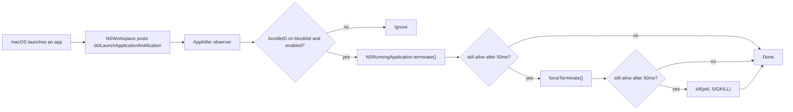

# NoStart

A tiny macOS menu-bar utility that watches for application launches and **instantly kills** any app on your blocklist. Inspired by [Overkill](https://github.com/KrauseFx/overkill-for-mac), rewritten in modern SwiftUI.

- Native macOS menu-bar app (no Dock icon)
- Light/dark mode automatic (system theme)
- Local only — no network, no telemetry
- **No Xcode required** — builds with the Swift Command-Line Tools

---

## Table of contents

1. [Requirements](#requirements)
2. [Quick start](#quick-start)
3. [Using the app](#using-the-app)
4. [The Settings window](#the-settings-window)
5. [Managing the app](#managing-the-app)
   - [Updating after code changes](#updating-after-code-changes)
   - [Bumping the version](#bumping-the-version)
   - [Uninstalling](#uninstalling)
   - [Where your data lives](#where-your-data-lives)
   - [Viewing logs](#viewing-logs)
6. [How it works](#how-it-works)
7. [Project layout](#project-layout)
8. [Troubleshooting](#troubleshooting)
9. [Changing the app icon](#changing-the-app-icon)
10. [Ideas for later](#ideas-for-later)

---

## Requirements

- macOS 14 Sonoma or newer.
- Xcode Command-Line Tools (you already have these if `swift --version` works).
  - If not: run `xcode-select --install` once.

**You do not need the full Xcode app.** Everything builds from Terminal using `swift build`.

---

## Quick start

Clone the repository anywhere you like and run the two scripts from inside the project directory:

```bash
git clone <this-repo-url> NoStart
cd NoStart

# 1. Build the .app bundle into ./build/
./build.sh

# 2. Install it into /Applications and launch it
./install.sh
```

`install.sh` will call `build.sh` for you if the bundle hasn't been built yet, so in practice just running `./install.sh` is enough the first time.

After `install.sh` finishes, look at the top-right of your menu bar — you should see a red stop-sign icon (`xmark.octagon.fill`). Click it to open the menu, then choose **Settings…** to manage your blocklist.

> First launch note: macOS may prompt the first time the app wants to observe application launches or register itself as a login item. Approve the prompt and NoStart is ready.

---

## Using the app

### From the menu bar

Click the NoStart icon in the menu bar to get a compact dropdown:

- **Enable NoStart** — global on/off switch. When off, no apps are blocked, regardless of individual rules.
- A live line showing how many apps are currently being blocked (e.g. _"Blocking 3 of 7 app(s)"_).
- **Settings…** — opens the full Settings window.
- **Quit NoStart** — stops the app.

### Adding an app to the blocklist

1. Open **Settings…** from the menu bar.
2. Expand the **Blocked Applications** section (chevron arrow on the left of the header).
3. Click **Add Application…** at the bottom of the section.
4. Pick one or more `.app` bundles. The picker defaults to `/Applications`, but you can browse anywhere — system apps live in `/System/Applications`.
5. They appear in the list and are now blocked.

The **Add Application…** row stays visible even when the section is collapsed, so you can quickly add apps without expanding the full list first. Adding an app will auto-expand the section so you can see what was just added.

### Turning blocking on/off

- **Per-app:** use the small toggle at the right of each row. A disabled row is dimmed.
- **Globally (pause everything):** use the large toggle at the top of the Settings window, or the **Enable NoStart** item in the menu bar menu.

### Removing an app

Click the red minus icon at the right end of the row. By default you'll get a confirmation dialog (see [Confirm before removing](#the-settings-window) below) — you can opt out of the prompt in General settings.

---

## The Settings window

The Settings window is laid out as three cards, top to bottom:

1. **Status card** — shows whether NoStart is currently active or paused, with the global toggle on the right.
2. **General** — app-wide preferences:
   - **Start at login** — registers NoStart with macOS as a login item via `SMAppService`, so it relaunches every time you log in. Flipping it off unregisters it.
   - **Confirm before removing** — when on, removing an app from the blocklist will ask for confirmation first. Turn this off for faster editing.
   - **Blocklist file** — shows the full path to the JSON file where your blocklist is stored, with a folder button that reveals it in Finder.
3. **Blocked Applications** — collapsible list of blocked apps.
   - Click the chevron in the header to expand or collapse. The state is remembered between launches.
   - A small badge next to the title shows `active/total` (e.g. `3/7` = three of seven rules are currently enabled).
   - Each row shows the app icon, display name, and bundle ID, with a per-app on/off toggle and a remove button.
   - **Add Application…** sits at the bottom and is always visible.

### Window sizing

- The Settings window **auto-sizes to its contents**: collapsing the blocklist shrinks the window, expanding it grows the window. Adding or removing apps changes the height accordingly.
- The titlebar blends into the content (no visible separator), so the window feels like a single card. Because of this, you can drag the window by clicking almost anywhere on it.
- Width is flexible within a sensible min/max range — drag the side of the window to resize.

---

## Managing the app

### Updating after code changes

Whenever you edit any Swift file under `Sources/NoStart/` (or tweak `AppBundle/Info.plist`), rebuild and reinstall from the project directory:

```bash
./install.sh          # build.sh runs automatically if needed
```

`install.sh` is safe to re-run: it quits the running instance, overwrites `/Applications/NoStart.app`, and relaunches. Your blocklist is preserved (it lives under your user's `~/Library/Application Support/NoStart/`, not inside the app bundle).

If you only want to rebuild without touching `/Applications`:

```bash
./build.sh
open build/NoStart.app
```

### Bumping the version

Edit `AppBundle/Info.plist` and change:

```xml
<key>CFBundleShortVersionString</key>
<string>1.0.0</string>        <!-- visible version -->
<key>CFBundleVersion</key>
<string>1</string>            <!-- internal build number -->
```

Then `./install.sh`.

### Uninstalling

From the project directory:

```bash
./uninstall.sh
```

This:

- quits the running app,
- unregisters the login item (if enabled),
- deletes `/Applications/NoStart.app`,
- deletes the saved blocklist at `~/Library/Application Support/NoStart/`,
- removes `UserDefaults` preferences for bundle id `dev.nostart.NoStart`.

The source tree is left untouched so you can rebuild later.

### Where your data lives

| What                  | Where                                                    |
| --------------------- | -------------------------------------------------------- |
| Blocklist (JSON)      | `~/Library/Application Support/NoStart/blocklist.json`   |
| Global on/off + UI prefs | `~/Library/Preferences/dev.nostart.NoStart.plist`     |
| App binary            | `/Applications/NoStart.app`                              |
| Source code           | Your local clone of the repo                             |
| Build output          | `./build/NoStart.app` and `./.build/` inside the repo    |
| Logs                  | `Console.app` → filter subsystem `dev.nostart.NoStart`   |

UI-level preferences (like whether the blocklist section is expanded, or whether to confirm before removing) are also stored in the app's `UserDefaults` and are included in the `.plist` above.

You can edit `blocklist.json` by hand if you prefer — quit the app first, then relaunch. Example entry:

```json
[
  { "bundleID": "com.example.SomeApp", "isEnabled": true, "name": "Some App" }
]
```

### Viewing logs

Open **Console.app**, click **Start streaming**, and paste this into the search bar:

```
subsystem:dev.nostart.NoStart
```

You'll see every kill decision the app makes. Useful to confirm it's actually firing.

---

## How it works



Key points:

- Apps are matched by **bundle identifier** (e.g. `com.example.SomeApp`) — stable across renames and updates.
- On launch the app also does a **sweep** of already-running apps, so if a blocked app is already open when you enable NoStart, it gets killed right away.
- Killing user-owned apps does **not** require Accessibility or Full Disk Access.

---

## Project layout

```
NoStart/
├── Package.swift              # Swift Package manifest (no Xcode needed)
├── AppBundle/
│   └── Info.plist             # Bundle metadata (LSUIElement=true, version, etc.)
├── Sources/NoStart/
│   ├── NoStartApp.swift       # @main App + AppDelegate
│   ├── Core/
│   │   ├── AppKiller.swift    # NSWorkspace observer + kill chain
│   │   ├── BlocklistStore.swift  # Persisted blocklist (JSON)
│   │   ├── LaunchAtLogin.swift   # SMAppService wrapper
│   │   └── Theme.swift        # Catppuccin-inspired color palette
│   ├── Models/
│   │   └── BlockedApp.swift
│   └── Views/
│       ├── MenuBarContent.swift  # Menu-bar dropdown
│       └── SettingsView.swift    # Settings window: cards, collapsible list, picker
├── build.sh                   # Compile + bundle into build/NoStart.app
├── install.sh                 # Copy to /Applications and launch
├── uninstall.sh               # Full removal
└── README.md
```

### Why Swift Package and not an Xcode project?

The whole Xcode app is ~15 GB. For a small utility like this, `swift build` from the Command-Line Tools is enough. The only thing SPM doesn't do on its own is wrap the binary into a `.app` bundle with an `Info.plist` — that's what `build.sh` does.

If you ever want to open this in Xcode (after installing it), run `xed .` from the project directory and Xcode will open the Swift Package directly.

---

## Troubleshooting

**"NoStart" can't be opened because it is from an unidentified developer.**
macOS Gatekeeper. Run `./install.sh` (it strips quarantine attributes), or right-click `/Applications/NoStart.app` and pick **Open** once.

**Icon doesn't appear in the menu bar.**
The menu bar might be full. Remove or reorder icons (Bartender/Ice can help), or try `killall SystemUIServer`.

**App doesn't kill a blocked app.**
1. Check it's actually running after you add it — if it was already running, NoStart sweeps on startup only. Quit and relaunch NoStart to force a resweep.
2. Confirm the bundle id matches. In the Settings window each row shows the bundle id in monospaced text under the app name; it should match what Activity Monitor shows.
3. Look at the log (Console.app, subsystem `dev.nostart.NoStart`).

**Start-at-login doesn't stick.**
macOS sometimes needs explicit approval. Open **System Settings → General → Login Items & Extensions** and make sure "NoStart" is listed and enabled there.

**Want to block a system daemon or helper?**
NoStart listens for `NSWorkspace` app launches — these are GUI apps, not background daemons. Daemons/agents aren't supported (and you generally shouldn't try to kill them this way).

**I get a compile error after editing a file.**
The error message from `./build.sh` points at the file and line. Fix it and rerun. If the error mentions a stale `ModuleCache` path (e.g. after moving the project folder), delete the `.build/` directory and rebuild.

---

## Changing the app icon

The build accepts either a single PNG or a pre-built `.icns`:

| File                      | What happens                                                      |
| ------------------------- | ----------------------------------------------------------------- |
| `AppBundle/AppIcon.png`   | Auto-converted to `AppIcon.icns` at build time (preferred).       |
| `AppBundle/AppIcon.icns`  | Used as-is. Only consulted if no `AppIcon.png` is present.        |

To swap the icon:

1. Replace `AppBundle/AppIcon.png` with your new artwork.
   - Recommended: **1024×1024** PNG with transparent background.
2. Rebuild and reinstall:
   ```bash
   ./install.sh
   ```

`build.sh` runs `sips` + `iconutil` (both built into macOS) to generate every required size (16, 32, 64, 128, 256, 512, 1024 px and their `@2x` variants) and bakes them into `Resources/AppIcon.icns`. `install.sh` also calls `lsregister -f` to nudge macOS into refreshing its icon cache so the new icon appears right away in Finder, Spotlight, and the menu-bar Settings window.

If macOS still shows the old icon somewhere (rare), force-flush the cache:

```bash
sudo rm -rf /Library/Caches/com.apple.iconservices.store
killall Dock Finder
```

---

## Ideas for later

Not implemented, but straightforward to add if you want:

- **Notifications** when an app is killed (UserNotifications framework).
- **Schedules** (e.g. block certain apps only during work hours).
- **Quick add** from a global hotkey or Shortcuts action.
- **Kill-by-path or regex** in addition to bundle id.
- **Export/import** the blocklist as a shareable file.
- **Groups** of rules you can enable/disable together (e.g. "Focus mode").
