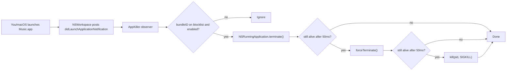

# NoStart

A tiny macOS menu-bar utility that watches for application launches and **instantly kills** any app on your blocklist. Inspired by [Overkill](https://github.com/KrauseFx/overkill-for-mac), rewritten in modern SwiftUI.

- Native macOS menu-bar app (no Dock icon)
- Light/dark mode automatic (system theme)
- Local only, no network, no telemetry
- **No Xcode required** — builds with the Swift Command-Line Tools

---

## Table of contents

1. [Requirements](#requirements)
2. [Quick start](#quick-start)
3. [Using the app](#using-the-app)
4. [Managing the app](#managing-the-app)
   - [Updating after code changes](#updating-after-code-changes)
   - [Uninstalling](#uninstalling)
   - [Where your data lives](#where-your-data-lives)
5. [How it works](#how-it-works)
6. [Project layout](#project-layout)
7. [Troubleshooting](#troubleshooting)
8. [Ideas for later](#ideas-for-later)

---

## Requirements

- macOS 14 Sonoma or newer (tested on macOS 26).
- Xcode Command-Line Tools (you already have these if `swift --version` works).
  - If not: run `xcode-select --install` once.

**You do not need the full Xcode app.** Everything builds from Terminal using `swift build`.

---

## Quick start

```bash
cd ~/Dev/NoStart

# 1. Build the .app bundle
./build.sh

# 2. Install it into /Applications and launch it
./install.sh
```

After `install.sh` finishes, look at the top-right of your menu bar — you should see a red stop-sign icon (`xmark.octagon.fill`). Click it to open the menu, then choose **Settings…** to manage your blocklist.

> First launch note: macOS may pop up a small dialog the first time the app wants to receive launch-notifications. Just accept it and the icon will appear.

---

## Using the app

### Adding an app to the blocklist

1. Click the NoStart icon in the menu bar → **Settings…**
2. Click **Add Application…**
3. Pick one or more `.app` bundles (defaults to `/Applications`, but you can browse anywhere — system apps live in `/System/Applications`).
4. They appear in the list. They are now blocked.

> Example: to always block Music, pick `/System/Applications/Music.app`.

### Turning blocking on/off

- **Per-app:** use the small toggle next to each row. A disabled row is dimmed.
- **Globally (pause everything):** use the toggle in the top-right of the Settings window, or the **Enable NoStart** item in the menu bar menu.

### Removing an app

Click the red trash icon next to the row.

### Start at login

In Settings, flip **Start at login**. macOS registers NoStart as a login item via `SMAppService`. The first time you enable this, macOS may show a "Login Items Added" banner — that's expected.

To revoke later: either flip the toggle off, or open **System Settings → General → Login Items** and remove "NoStart".

---

## Managing the app

### Updating after code changes

Whenever you edit any Swift file under `Sources/NoStart/` (or tweak `AppBundle/Info.plist`), rebuild and reinstall:

```bash
cd ~/Dev/NoStart
./install.sh          # build.sh runs automatically if needed
```

`install.sh` is safe to re-run: it quits the running instance, overwrites `/Applications/NoStart.app`, and relaunches. Your blocklist is preserved (it lives in `~/Library/Application Support/NoStart/`, not inside the app).

If you only want to rebuild without touching `/Applications`:

```bash
./build.sh
open build/NoStart.app
```

### Bumping the version

Edit `AppBundle/Info.plist` and change:

```xml
<key>CFBundleShortVersionString</key>
<string>1.0.0</string>        <!-- visible version -->
<key>CFBundleVersion</key>
<string>1</string>             <!-- internal build number -->
```

Then `./install.sh`.

### Uninstalling

```bash
cd ~/Dev/NoStart
./uninstall.sh
```

This:
- quits the running app,
- unregisters the login item (if enabled),
- deletes `/Applications/NoStart.app`,
- deletes the saved blocklist at `~/Library/Application Support/NoStart/`,
- removes `UserDefaults` preferences for bundle `dev.nostart.NoStart`.

The source tree at `~/Dev/NoStart` is left untouched so you can rebuild later.

### Where your data lives

| What | Where |
| --- | --- |
| Blocklist (JSON) | `~/Library/Application Support/NoStart/blocklist.json` |
| Global on/off toggle | `~/Library/Preferences/dev.nostart.NoStart.plist` (managed by `defaults`) |
| App binary | `/Applications/NoStart.app` |
| Source code | `~/Dev/NoStart/` |
| Build output | `~/Dev/NoStart/build/NoStart.app` and `~/Dev/NoStart/.build/` |
| Logs | `Console.app` → filter subsystem `dev.nostart.NoStart` |

You can edit `blocklist.json` by hand if you prefer — quit the app first, then relaunch. Example entry:

```json
[
  { "bundleID": "com.apple.Music", "isEnabled": true, "name": "Music" }
]
```

### Viewing logs

Open **Console.app**, click **start streaming**, and paste this into the search bar:

```
subsystem:dev.nostart.NoStart
```

You'll see every kill decision the app makes. Useful to confirm it's actually firing.

---

## How it works



Key points:

- Apps are matched by **bundle identifier** (e.g. `com.apple.Music`) — stable across renames and updates.
- On launch the app also does a **sweep** of already-running apps, so if a blocked app is already open when you enable NoStart, it gets killed right away.
- Killing user-owned apps does **not** require Accessibility or Full Disk Access.

---

## Project layout

```
~/Dev/NoStart/
├── Package.swift              # Swift Package manifest (no Xcode needed)
├── AppBundle/
│   └── Info.plist             # Bundle metadata (LSUIElement=true, version, etc.)
├── Sources/NoStart/
│   ├── NoStartApp.swift       # @main App + AppDelegate
│   ├── Core/
│   │   ├── AppKiller.swift    # NSWorkspace observer + kill chain
│   │   ├── BlocklistStore.swift  # Persisted blocklist (JSON)
│   │   └── LaunchAtLogin.swift   # SMAppService wrapper
│   ├── Models/
│   │   └── BlockedApp.swift
│   └── Views/
│       ├── MenuBarContent.swift  # Dropdown menu
│       └── SettingsView.swift    # Main settings window + picker + rows
├── build.sh                   # Compile + bundle into build/NoStart.app
├── install.sh                 # Copy to /Applications and launch
├── uninstall.sh               # Full removal
└── README.md
```

### Why Swift Package and not an Xcode project?

The whole Xcode app is ~15 GB. For a small utility like this, `swift build` from Command-Line Tools is enough. The only thing SPM doesn't do on its own is wrap the binary into a `.app` bundle with an `Info.plist` — that's what `build.sh` does.

If you ever want to open this in Xcode (after installing it), you can just run `xed .` from this folder and Xcode will open the Swift Package directly.

---

## Troubleshooting

**"NoStart" can't be opened because it is from an unidentified developer.**
macOS Gatekeeper. Run `./install.sh` (it strips quarantine), or right-click `/Applications/NoStart.app` and pick **Open** once.

**Icon doesn't appear in the menu bar.**
The menu bar might be full. Remove or reorder icons (Bartender/Ice can help), or try `killall SystemUIServer`.

**App doesn't kill a blocked app.**
1. Check it's actually running after you add it — if it was already running, NoStart sweeps on startup only. Quit NoStart and relaunch.
2. Check the bundle ID matches. In the settings window, the bundle ID is shown in monospaced text under the name. Confirm it matches what Activity Monitor shows.
3. Look at the log (Console.app, subsystem `dev.nostart.NoStart`).

**Start-at-login doesn't stick.**
macOS sometimes needs an explicit approval. Open **System Settings → General → Login Items** and make sure "NoStart" is listed and enabled there.

**Want to block a system daemon or helper?**
NoStart listens for `NSWorkspace` app launches — these are GUI apps, not background daemons. Daemons/agents aren't supported (and you generally shouldn't try to kill them this way).

**I get a compile error after editing a file.**
The error message from `./build.sh` points at the file and line. Fix it and rerun. Common gotcha: forgetting `import SwiftUI` or `import AppKit` at the top of a new file.

---

## Ideas for later

Not implemented, but straightforward to add if you want:

- **Notifications** when an app is killed (UserNotifications framework).
- **Schedules** (e.g. block Music only during work hours).
- **Quick add** from a global hotkey or Shortcuts action.
- **Kill-by-path or regex** in addition to bundle ID.
- **Export/import** the blocklist as a shareable file.
- **App icon:** see [Changing the app icon](#changing-the-app-icon) below.

---

## Changing the app icon

The build accepts either a single PNG or a pre-built `.icns`:

| File | What happens |
| --- | --- |
| `AppBundle/AppIcon.png` | Auto-converted to `AppIcon.icns` at build time (preferred). |
| `AppBundle/AppIcon.icns` | Used as-is. Only consulted if no `AppIcon.png` is present. |

To swap the icon:

1. Replace `~/Dev/NoStart/AppBundle/AppIcon.png` with your new artwork.
   - Recommended: **1024×1024** PNG with transparent background.
2. Rebuild and reinstall:
   ```bash
   cd ~/Dev/NoStart
   ./install.sh
   ```

`build.sh` runs `sips` + `iconutil` (both built into macOS) to generate every required size (16, 32, 64, 128, 256, 512, 1024 px and their `@2x` variants) and bakes them into `Resources/AppIcon.icns`. `install.sh` also calls `lsregister -f` to nudge macOS into refreshing its icon cache so the new icon appears right away in Finder, Spotlight, and the menu-bar Settings window.

If macOS still shows the old icon somewhere (rare), force-flush the cache:

```bash
sudo rm -rf /Library/Caches/com.apple.iconservices.store
killall Dock Finder
```
